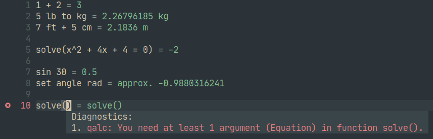

# qalc.nvim

*inspired by [quickmath.nvim](https://github.com/jbyuki/quickmath.nvim)*

A Neovim plugin for live calculations with unit conversions, equation solving, basic calculus functionality, and more. Powered by [`libqalculate`](https://github.com/Qalculate/libqalculate).



## Features

- Evaluates expressions in a Neovim buffer and updates results in virtual text on buffer content change
- Shows warnings and errors from expressions as Neovim diagnostics

## Installation

Requires CMake, pkg-config, LuaJIT, and libqalculate to be installed.

Install using your preferred plugin manager:

- [vim-plug](https://github.com/junegunn/vim-plug)
```vim
Plug 'Apeiros-46B/qalc.nvim', { 'do': { -> luafile build.lua } }
```

- [lazy.nvim](https://github.com/folke/lazy.nvim)
```lua
'Apeiros-46B/qalc.nvim'
```

## Usage

Edit a file with extension `.qalc` or use the `:Qalc` command.
The `:Qalc` command optionally accepts one argument; the name of the newly created buffer.

Alternatively, you can attach to an existing buffer using `:QalcAttach`.

You can yank the result on the current line with `:QalcYank`, which takes an optional register (see `:h setreg()`). The default register can be configured (see below).

All commands accepted in the buffer are `qalc` commands.

## Configuration

To configure, call the `setup` function.

```lua
require('qalc').setup({
    -- your config goes here
})
```

Keep in mind that this plugin is still under development so configuration keys may change or be removed at any time.

<details>
  <summary>Default configuration</summary>

  TODO: update this section when configuration is finalized

  ```lua
  local config = {
      -- extra command arguments for Qalculate
      -- do NOT use the option `-t`/`--terse`; it will break the plugin
      -- example: { '--set', 'angle deg' } to use degrees as the default angle unit
      cmd_args = {}, -- table

      -- default name of a newly opened buffer
      -- set to '' to open an unnamed buffer
      bufname = '', -- string

      -- the plugin will set all attached buffers to have this filetype
      -- set to '' to disable setting the filetype
      -- the default is provided for basic syntax highlighting
      set_ft = 'config', -- string

      -- file extension to automatically attach qalc to
      -- set to '' to disable automatic attaching
      attach_extension = '*.qalc', -- string

      -- default register to yank results to
      -- default register = '@'
      -- clipboard        = '+'
      -- X11 selection    = '*'
      -- other registers not listed are also supported
      -- see `:h setreg()`
      yank_default_register = '@', -- string

      -- sign shown before result
      sign = '=', -- string

      -- whether or not to show a sign before the result
      show_sign = true, -- boolean

      -- whether or not to right align virtual text
      right_align = false, -- boolean

      -- highlight groups
      highlights = {
          sign     = '@conceal', -- sign before result
          result   = '@string',  -- result in virtual text
      },

      -- diagnostic options
      -- set to nil to respect the options in your neovim configuration
      -- (see `:h vim.diagnostic.config()`)
      diagnostics = { -- table?
          underline = true,
          virtual_text = false,
          signs = true,
          update_in_insert = true,
          severity_sort = true,
      }
  }
  ```
</details>

## Planned Changes

The following is a list of things I will most likely change/implement in the future (when I have enough free time). Items are ordered by priority, descending.

- (feat) Re-implementing the functionality of the `qalc` CLI commands such as "set" and "delete"
- (perf) Make recalculation async instead of blocking the main thread
- (perf) Only recalculating what is necessary instead of recalculating the whole buffer on every update
- (feat) Adding fancy visual effect (optional) when values are recalculated
- (feat) Adding [nvim-cmp](https://github.com/hrsh7th/nvim-cmp) integration for completion of variables, functions, and units
