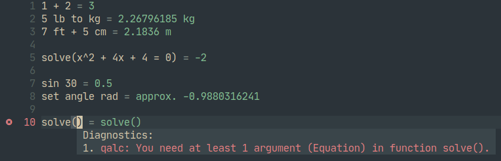

# qalc.nvim

*inspired by [quickmath.nvim](https://github.com/jbyuki/quickmath.nvim)*

A Neovim plugin for reactive spreadsheet-like calculations with unit
conversions, algebra, calculus, graph plotting, and more. Powered by
[`libqalculate`](https://github.com/Qalculate/libqalculate).



## Features

- All mathematical constructs supported by `libqalculate`
- gnuplot integration (use `plot(f(x))`)
- Syntax highlighting
- Warnings and errors from expressions are shown as diagnostics
- [`nvim-cmp`](https://github.com/hrsh7th/nvim-cmp) integration for
  autocomplete and documentation of functions, constants, variables, and units

## Installation

Requires Neovim >=0.12, CMake >=3.10, libqalculate >=5.0.0, LuaJIT, and libuv.
If you want to use the plotting feature, you also need gnuplot. The libuv headers
and library used to build the plugin must be ABI-compatible with the version
your Neovim was built with.

Install using your preferred plugin manager (example for [lazy.nvim](https://github.com/folke/lazy.nvim)):

```lua
{
    'Apeiros-46B/qalc.nvim',
    opts = {},
}
```

You can lazy load if you want (with `ft = 'qalc', cmd = 'Qalc'`) but most of
the plugin loading is already deferred.

### cmp integration

Add `{ name = 'qalc' }` to your cmp sources.

### Nix build

If you have [Nix](https://nixos.org/) available on your system, you can use it
to build the C++ backend:

```lua
{
    'Apeiros-46B/qalc.nvim',
    build = 'build_nix.lua',
    opts = {},
}
```

## Usage

Edit a file with extension `.qalc` or use the `:Qalc` command to create a new
calculator buffer. The `:Qalc` command optionally accepts one argument for the
name of the newly created buffer.

You can yank the result on the current line with `:QalcYank`, which takes an
optional register (see `:h setreg()`). The default register can be configured
(see below).

If the state of the calculation is somehow broken, you can use `:QalcReset` to
force a rebuild of the dependency graph and re-evaluate every line. You can
also attach calculation hooks to an existing buffer using `:QalcAttach`.

Calculator options can be set using `:QalcSet` with the same option names as
the `qalc` CLI, (but with spaces replaced by underscores and apostrophes
removed). Named values also use underscores, such as `half_to_even`,
`try_exact`, and `golden_ratio`. Tab completion includes option names, aliases,
and accepted named values.

Use `:QalcSet` without arguments to show current overrides. Omitting a value
resets that option to its default. For boolean settings, use explicit
`true`/`false` values.

## Incompatibilities with the qalc CLI

Due to the `qalc` CLI frontend being extremely complex and this plugin's heavier
emphasis on reactive recalculation, 1:1 feature parity with it is not a goal.
Some incompatible behaviors:

- The buffer does not evaluate top-down like code; defined variables can be
  referenced anywhere (akin to a 1D spreadsheet with named values).
- `ans` is not implemented. Use named variables instead.
- A persistent RPN stack with manipulation commands is not possible due to the
  evaluation order. RPN *syntax* is still supported (`:QalcSet parsing_mode rpn`).
- There are some workarounds necessary to make dependency tracking tractable.
  - Unknown-symbol parsing is always enabled.
  - Implicit multiplication of symbols (`xy` = `x * y`) is always disabled.
    Numeric implicit multiplication (`2x`) or implicit multiplication with a
    space (`x y`) is still allowed though.
  - Functions and variables are treated like they are in one namespace even though
    libqalculate internally treats them as separate.

## Unfixable issues

- If you have multiple large qalc buffers, you may experience some lag when
  switching between them. This is due to a technical limitation within
  `libqalculate` itself that I unfortunately can't really do anything about.
  In this case, prefer using multiple nvim processes with one qalc buffer per
  nvim to sidestep the issue.

## Configuration

To configure, call the `setup` function.

```lua
require('qalc').setup({
    -- see configuration keys below
})
```

<details>
  <summary>Default configuration</summary>

  ```lua
  M.cfg = {
      -- default name of a newly opened buffer
      -- set to '' to open an unnamed buffer
      bufname = '', -- string

      -- default register to yank results to
      -- default register = '@'
      -- clipboard        = '+'
      -- X11 selection    = '*'
      -- other registers not listed are also supported
      -- see `:h setreg()`
      yank_default_register = '@', -- string

      -- qalc CLI-style calculator options (same keys and values as :QalcSet)
      -- e.g. { angle_unit = 'degrees' }
      options = {},

      display = {
          -- sign shown before result (false to disable)
          sign = '=', -- string or false

          -- placeholder shown while result is evaluating (false to disable)
          placeholder = '...', -- string or false

          -- whether or not to right align virtual text
          right_align = false, -- boolean

          -- display style for multiline results
          -- 'below': virtual lines below
          -- 'collapse': make multiline results single-line
          -- 'extend': virtual text at end of line + aligned virtual lines
          multiline_style = 'below', -- string

          -- highlight groups (see `:h nvim_set_hl()`)
          highlights = { -- table
              sign = { link = '@conceal' }, -- sign before result
              result = { link = '@string' }, -- normal result
          },

          -- diagnostic options (false to respect the options in your Neovim config)
          -- (see `:h vim.diagnostic.config()`)
          diagnostics = { -- table or false
              underline = true,
              virtual_text = false,
              signs = true,
              update_in_insert = true,
              severity_sort = true,
          },

          -- hover options
          -- (see `:h vim.lsp.util.open_floating_preview.Opts`)
          hover = {}
      },
  }
  ```
</details>
